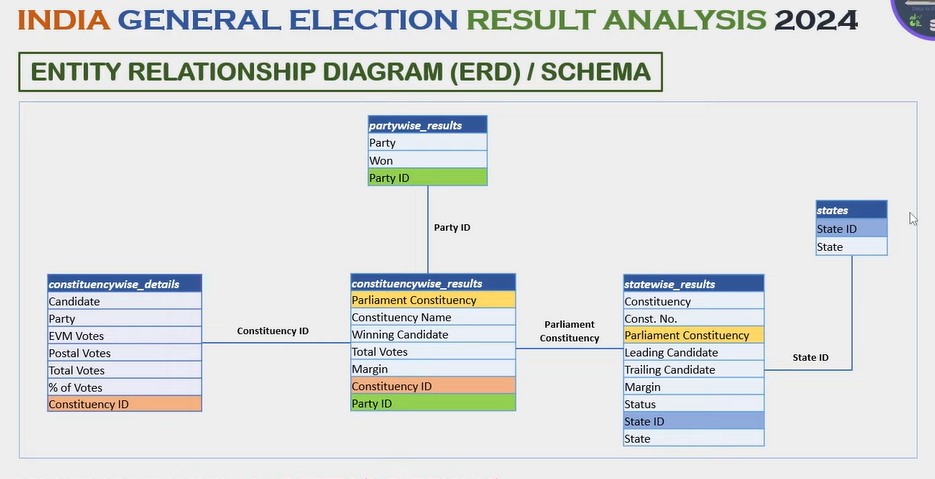

# 🗳️ Election2024_Exploratory_Data_Analysis_SQL

Welcome to the Election Data Analysis SQL Project! This project focuses on analyzing the 2024 India General Election results using Microsoft SQL Server and SQL-based analytical techniques.

Using a well-structured dataset built from real-world election data, the project uncovers valuable insights into vote distribution, political party performance, constituency-level outcomes, and regional voting patterns through comprehensive SQL analysis.

---

## 🖥️ Requirements

- **Operating System:** Windows, macOS, or Linux.
- **SQL Server Management Studio:** The latest version installed on your machine. [DOWNLOAD HERE](https://learn.microsoft.com/en-us/ssms/install/install)
- **Data Files:** This project uses a specific datasets(.csv format)

---

## 📊 Understanding the Project Structure

This project contains several components:

- **Data Files:** These provide the election datasets for analysis.
- **SQL Scripts:** These help you run specific queries to extract insights.

---

## 🤝ER Diagram

## 🔍 Key Performance Indicators (KPIs)

* Total seats won across each state by individual alliance parties
* Overall vote share secured by each political party
* State-wise analysis of dominant and leading political parties
* Candidates receiving the highest number of EVM votes
* Regional voting patterns and voter turnout analysis
* Insightful data exploration through advanced SQL queries on large datasets

---

## 🔍 Key Features

* **Comprehensive Election Data Analysis:** Perform in-depth analysis on the Indian General Election dataset using SQL.
* **Advanced SQL Concepts:** Utilize techniques such as CTEs, joins, subqueries, aggregate functions, and window functions for analytical querying.
* **Data Preparation & Cleaning:** Process and structure raw datasets to ensure accurate and efficient analysis.
* **Insightful Reporting:** Generate meaningful insights and analytical reports from large-scale election data.

---

## 📊 Project Objectives

* Showcase the effectiveness of SQL in analyzing real-world political and electoral datasets
* Extract meaningful insights and trends from structured election data
* Convert raw CSV datasets into actionable analytical summaries
* Support transparent, data-driven understanding of election outcomes and voting patterns

---

## 🙋‍♀️ Author

**THE DATADLINE**
